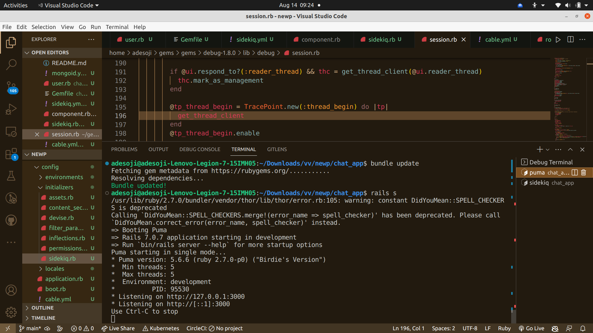
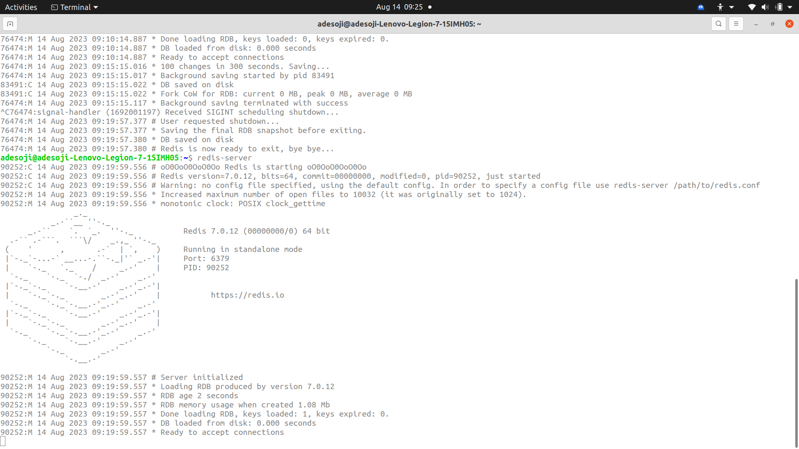
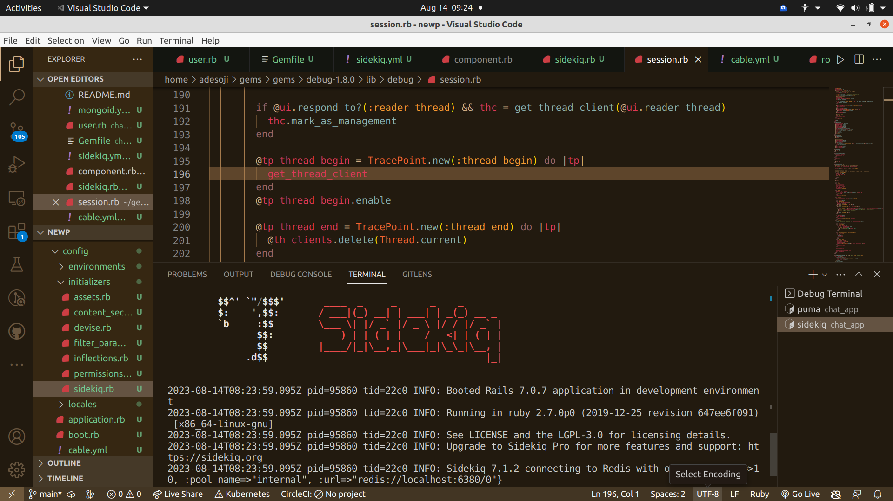
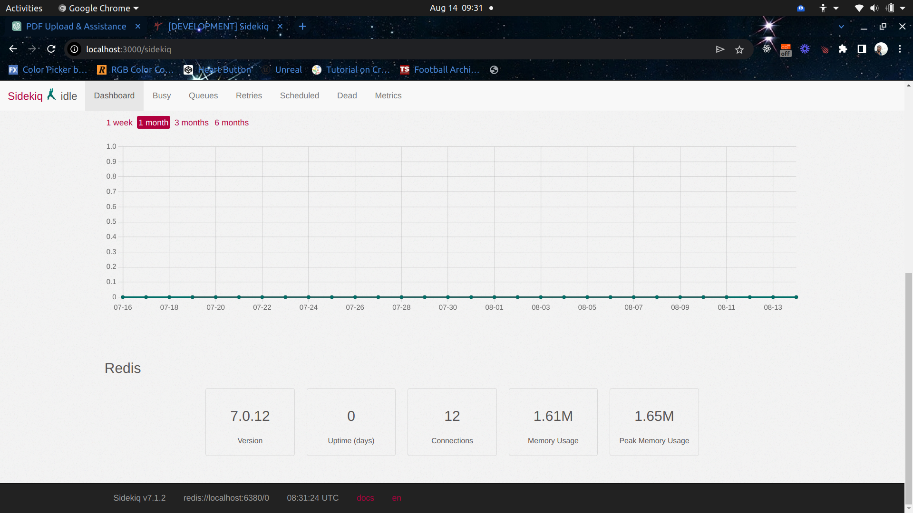
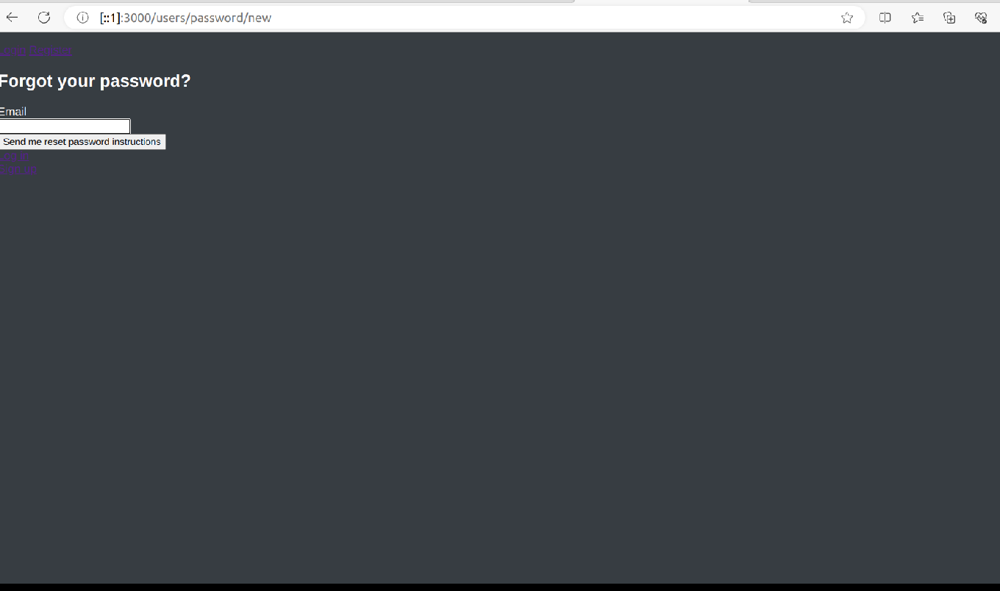
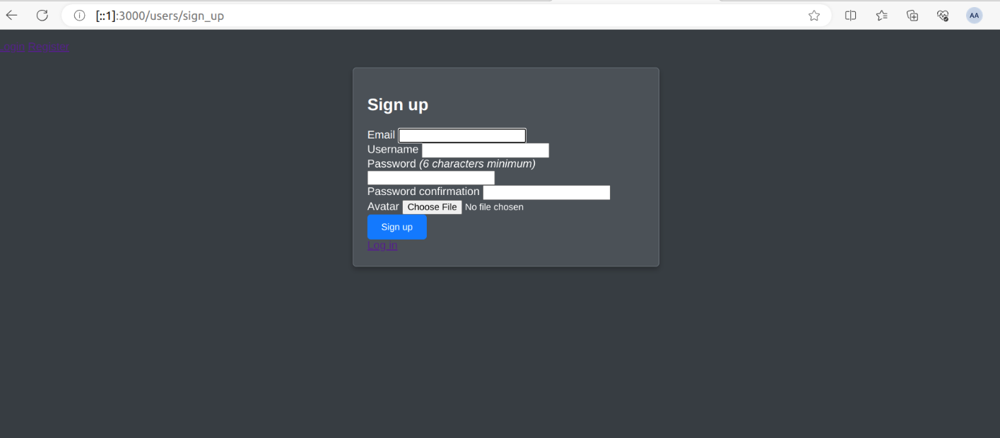

# **1. Project Setup:**

## **a. Initialize a new Ruby on Rails application:**

   clone:  gh repo clone Adesoji1/Chat_app 


1. First, ensure you have Ruby, Rails, and Bundler installed on your machine. If not, you can install them using the following commands:

   ```bash
   # Install Ruby (using RVM)
   \curl -sSL https://get.rvm.io | bash -s stable --ruby

   # Install Rails
   gem install rails

   # Install Bundler
   gem install bundler
   ```

2. Once you have the necessary tools installed, create a new Rails application:

   ```bash
   rails new chat_app
   ```

   This will create a new directory called `chat_app` with all the necessary Rails files and directories.

3. Navigate to the project directory:

   ```bash
   cd chat_app
   ```

4. Run the Rails server to ensure everything is set up correctly:

   ```bash
   rails server
   ```

   You should be able to visit `http://localhost:3000` in your browser and see the default Rails welcome page.

#### **b. Set up the project repository on GitHub:**

1. First, ensure you have Git installed. If not, you can [download and install Git](https://git-scm.com/downloads).

2. Navigate to your project directory (if you aren't already there):

   ```bash
   cd chat_app
   ```

3. Initialize a new Git repository:

   ```bash
   git init
   ```

4. Add all the files to the repository and make an initial commit:

   ```bash
   git add .
   git commit -m "Initial commit"
   ```

5. Go to [GitHub](https://github.com/) and log in (or sign up if you don't have an account).

6. Click on the '+' icon in the top right corner and select 'New repository'.

7. Name your repository (e.g., `chat_app`), provide a description, and keep it public or private based on your preference.

8. Click on 'Create repository'.

9. Now, link your local repository to the GitHub repository. Replace `YOUR_USERNAME` with your GitHub username:

   ```bash
   git remote add origin https://github.com/YOUR_USERNAME/chat_app.git
   ```

10. Push your code to the GitHub repository:

    ```bash
    git push -u origin master
    ```

Visualize the application loaded in your terminal as seen here on port 3000
 

Visualize the  Redis application loaded in your terminal as seen here on port 6379
 

```bash
bundle exec sidekiq
```
commands starts sidekiq.

Visualize the  Sidekiq application loaded in your terminal as seen in the image below
 

Sidekiq is a popular background processing framework for Ruby on Rails applications (and other Ruby-based applications). It uses Redis as its backend data store. The relationship between Sidekiq and Redis can be explained as follows:

1. **Sidekiq Relies on Redis**: Sidekiq uses Redis as a message broker and data store to manage background jobs. Redis provides a fast and efficient way to store job data and manage queues.

2. **Queue Management**: Sidekiq allows you to define and manage queues for your background jobs. These queues are implemented using Redis data structures. When you enqueue a job, it's added to a Redis queue.

     Look below to see a queue dashboard 
   


3. **Concurrency**: Sidekiq uses Redis to manage job concurrency. You can configure the number of worker processes that can process jobs concurrently. Redis helps ensure that jobs are processed by workers in a distributed and efficient manner.

4. **Job Serialization**: Sidekiq serializes job data and stores it in Redis. This includes information about the job class, arguments, and other relevant details. When a worker picks up a job, it deserializes the data to perform the task.

5. **Monitoring and Dashboard**: Sidekiq provides a web-based dashboard for monitoring and managing the background jobs. This dashboard is also powered by Redis, as it retrieves and displays job information stored in Redis.

6. **Persistence**: Redis stores job data persistently, which means that even if your application crashes or is restarted, Sidekiq can recover the queued jobs from Redis and continue processing them.

In summary, Redis serves as the backend data store and message broker for Sidekiq, allowing it to efficiently manage and process background jobs in a Ruby application. The combination of Sidekiq and Redis provides a scalable and reliable solution for handling asynchronous tasks.


Now, your Rails application is set up locally and is also available on GitHub. You can continue building features, committing changes, and pushing updates to the repository as you progress with the development.

The different pages are seen below for register and forgot passowrd

 




## Technologies Used

- [Ruby on Rails](https://rubyonrails.org/): A powerful web application framework.
- [Mongodb](https://www.mongodb.com/): A  NoSQL database for storing and managing data.
- [Sidekiq](https://sidekiq.org/): A background job processing framework for Ruby.
- [Redis](https://redis.io/): An in-memory data store and message broker.

- [Puma](https://github.com/puma/puma) : A Ruby Web Server Built For Parallelism


